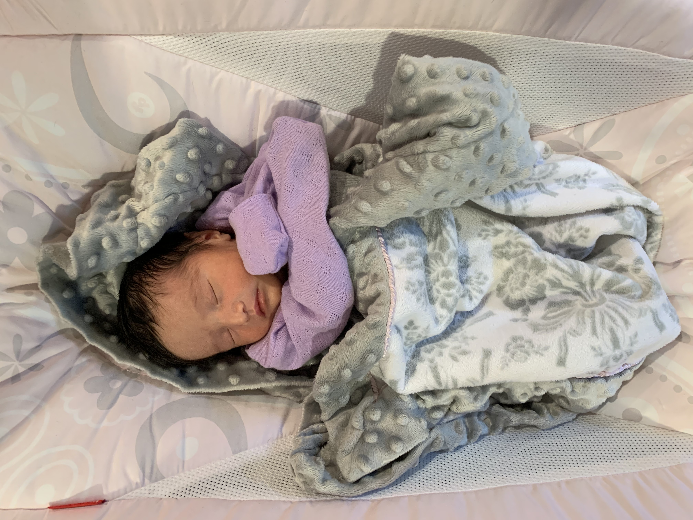
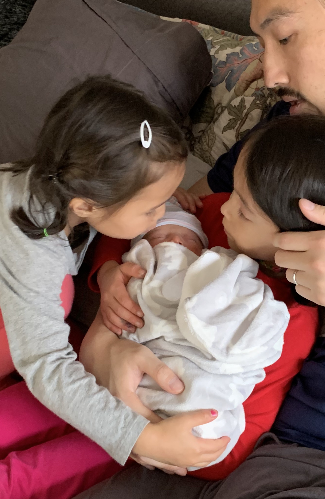

# This is Jerry Chao's website

Welcome to my website.  I am a pediatric anesthesiologist and clinical researcher at Albert Einstein College of Medicine, Montefiore Medical Center studying the neuroscience of early anesthesia.

# A new addition to our family

My wife and I welcomed our third child, Violet Ruth Chao, born on October 28, 2020.  

Big sisters Olive and Marigold are smitten!

Olive is a great big sister - already cuddling Violet super carefully

That look on Marigold's face!

## Our furry menagerie

Violet further displaces our pets: Hanky (our black lab/setter mix rescue, 5-and-a-half years old) and Benny (our black cat rescure, 2 years old).  When we adopted Benny when he was a kitten, he immediately bonded with Hanky.  We think Hanky was imprinted on Benny, who treats Hanky as a big brother in his pack.  We call Benny our cat-dog because he behaves more like a dog that a cat!  He even comes out on walks with us - off leash!  They are best buddies.

Posey is our golden retriever and chow chow mix rescue, also around 5-and-a-half years old - here's a picture of her when she was around 2.  Not pictured is Cleo, our second cat - she is white with light gray splotches.  Her brother Alfie died of pancreatitis last year :*(  We have a furry menagerie in our house!

# Links to other websites

Here are some links to other websites about me:

* [GitHub account](https://github.com/chaojy/chaojy.github.io)
* [Montefiore faculty page](https://www.montefiore.org/body.cfm?id=4148&action=detail&ref=3900)
* [Children's Hospital faculty page](https://www.cham.org/patients-families/find-a-doctor/jerry-y-chao-md-11118634)
* [Albert Einstein faculty page](https://www.einstein.yu.edu/faculty/13000/jerry-chao/)
* [Elsevier Pure](https://einstein.pure.elsevier.com/en/persons/jerry-y-chao)
* [twitter](https://twitter.com/JerryChaoMD)
* [LinkedIn](https://www.linkedin.com/in/jerry-y-chao-3852b84)

# Link to page within the site

[About me](about.html)